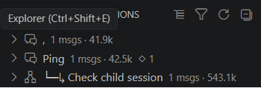
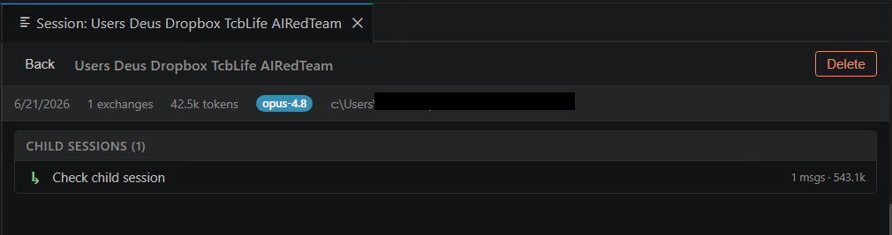

<div align="center">


# Agent Chat Tree

**Visualize, navigate, and manage your Claude Code sessions as an interactive tree — right inside VS Code.**

[](https://code.visualstudio.com/)
[](LICENSE)
[](https://claude.com/claude-code)

</div>

---

Agent Chat Tree reads your Claude Code session logs (`~/.claude/projects/**/*.jsonl`)
and turns them into a navigable tree. See how sessions relate — including **forks**
and **manually-linked child sessions** — browse the prompts in each conversation, and
resume or branch any session without leaving the editor.

## ✨ Highlights

- 🌳 **Session tree in the sidebar** — every session for the current workspace, with its prompts one click away.
- 🔱 **Automatic fork detection** — sessions resumed/branched from another are detected from the logs and nested under their origin.
- 🔗 **Manual child sessions** — start a fresh session and attach it under any parent to keep related work grouped.
- ↪️ **Resume anywhere** — relaunch a session in an integrated terminal or in the Claude Code extension.
- 🧭 **Workspace-scoped** — shows only the sessions for the folder you have open (toggle to see all).
- 🗑️ **Manage sessions** — delete sessions you no longer need, with a confirmation step.
- ⚡ **Live updates** — the view refreshes as Claude Code writes new entries.

## 📸 Screenshots

### Sidebar — sessions, forks & child sessions

The activity-bar view lists each session. Forks (`⑂`) and manual children (`↳`) are
nested under their parent with a connector, so relationships are obvious at a glance.

<p align="center">
  
</p>

### Tree View — a session and its descendants

Open any session to inspect its prompts, token usage, and the full tree of child
sessions (including child-of-child). Resume or delete from the toolbar.

<p align="center">
  
</p>

## 🚀 Getting started

1. Open the Command Palette — `Ctrl+Shift+P` / `Cmd+Shift+P`.
2. Run **Agent Chat Tree: Open Session Browser**, or open the **Agent Chat Tree**
   view from the activity bar.
3. Click a session to open its tree view. Use the inline buttons to resume or start
   a child session.

## 🧩 How relationships are detected

| Relationship | How it's found | Marker |
|--------------|----------------|--------|
| **Fork** | A session's root entry carries a `logicalParentUuid` that resolves to a message in another session. | `⑂` git-branch |
| **Manual child** | You create a new session via **New Child Session**; the link is recorded and persisted. | `↳` arrow |

Both nest recursively, so a child-of-a-child appears under its own parent.

## ⌨️ Commands

| Command | Description |
|---------|-------------|
| `Agent Chat Tree: Open Session Browser` | Open the webview session browser |
| `Agent Chat Tree: Open Tree View` | Open a session's tree view |
| `Agent Chat Tree: Resume Session in Terminal` | Resume a session (terminal or Claude Code extension) |
| `Agent Chat Tree: New Child Session` | Start a new session linked under a parent |
| `Agent Chat Tree: Delete Session` | Delete a session log (with confirmation) |
| `Agent Chat Tree: Toggle Workspace-Only / All Sessions` | Switch between current-workspace and all sessions |
| `Agent Chat Tree: Refresh` / `Refresh Sidebar` | Reload sessions |

## ⚙️ Settings

| Setting | Default | Description |
|---------|---------|-------------|
| `agentChatTree.workspaceOnly` | `true` | Show only sessions whose working directory matches the current workspace folder. |
| `agentChatTree.resumeTarget` | `ask` | Where to resume a session: `ask`, `terminal`, or `extension`. |
| `agentChatTree.maxSessions` | `50` | Maximum number of recent sessions to show. |
| `agentChatTree.claudeProjectsDir` | `""` | Path to the Claude projects directory. Empty = auto-detect `~/.claude/projects`. |

## 🛠️ Development

```bash
npm install
npm run compile        # one-shot build
npm run watch          # incremental build
```

Press `F5` in VS Code to launch an Extension Development Host.

### Build a VSIX

```bash
npx @vscode/vsce package
```

Produces `agent-chat-tree-<version>.vsix`. Install it with:

```bash
code --install-extension agent-chat-tree-<version>.vsix
```

## 🔒 Security

- All session content (which originates from log files) is rendered with
  `textContent` — never via `innerHTML` interpolation.
- The webview's inline bootstrap JSON is escaped against `</script>` and Unicode
  line-terminator breakouts, behind a Content-Security-Policy with a
  `crypto.randomBytes` nonce.
- Session ids are validated against a strict charset before ever reaching a shell
  command, preventing command injection.

## 📄 License

[MIT](LICENSE) © dn9uy3n
